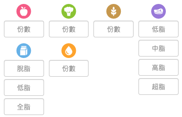

# Sixgroup Calculator

As part of our application process, we'd like to see what you can produce by giving you a small assignment. It should take you no more than a few hours to complete the assignment, but any extra polish or features you might want to put in will not go unnoticed.

## The assignment

We would like you to create a sixgroup (六大類) calculator app. The features it should include:

- [ ] Display a food record with a photo.
- [ ] Display sixgroup items of the record. Items may include name and calorie.
- [ ] Display nutrition summary of the record. Use donut chart to show record's calorie percentage from three macro nutritions.
- [ ] Add sixgroup items to the record. Items may take name and sixgroup info as inputs.

### Instructions

- An edit/save button may be added to the record to switch the overall status.
- Sixgroups and their sub-groups:
  - `fruits`
  - `vegetables`
  - `grains`
  - `oil`
  - `milk`
    - `milk_skim`
    - `milk_low_fat`
    - `milk_whole_fat`
  - `meat_beans`
    - `meat_beans_low_fat`
    - `meat_beans_medium_fat`
    - `meat_beans_high_fat`
    - `meat_beans_super_high_fat`
- Each sixgroup or sub-group (except for `milk` and `meat_beans`) should take input of float number with 2 decimal places (ex. 3.25) as `portion`
- A possible layout of sixgroup inputs you can start with:

  

- Each sixgroup or sub-group (except for `milk` and `meat_beans`) has its nutrition definition in terms of weight (g) of three macro nutritions (`protein`, `carbohydrate` and `fat`) defined in [Constants.js](./src/Constants.js)
- how calories is calculated: `sixgroup portions` -> `weights of three macros` -> `calories of three macros` -> `total calories`. All the numbers required is in [Constants.js](./src/Constants.js)
- Nutrition summary of the record should contain:
  - **total calorie**
  - **calorie percentage** from each of the three macro nutritions, total 100% (ex. `{protein: 0.25, fat: 0.3, carbohydrate: 0.45}` )
  - **total of each sixgroup**, ex: a record with item#1 `{fat: 2, meat_beans_low_fat: 1, grains: 2}` and item#2 `{fat: 1, meat_beans_low_fat: 3, fruit: 1.5}` should have `{fat: 3, meat_beans_low_fat: 4, grains: 2, fruit: 1.5}` as total of each sixgroup

### Extra credit features

- [ ] Responsive, works in desktop and mobile
- [ ] Polish and UX
- [ ] Highly reusable components
- [ ] Tests

## Requirements

You should use the following tools to accomplish this task:

- React
- Webpack (should run with webpack-dev-server)
- Babel - ES6/7 Syntax - you pick the stages

If you have any questions, please ask!

To complete your homework, please fork this repo and commit your work to your fork. When you are ready for us to look at it, give us access to your fork so we can review and run it.
